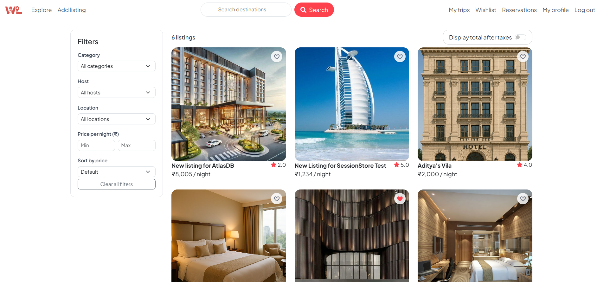
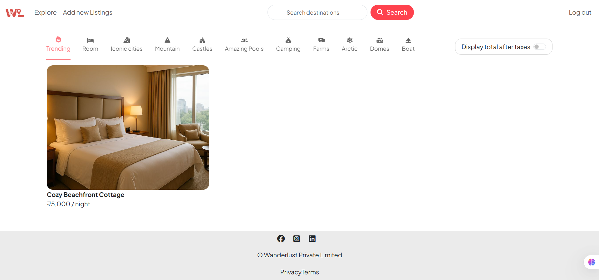
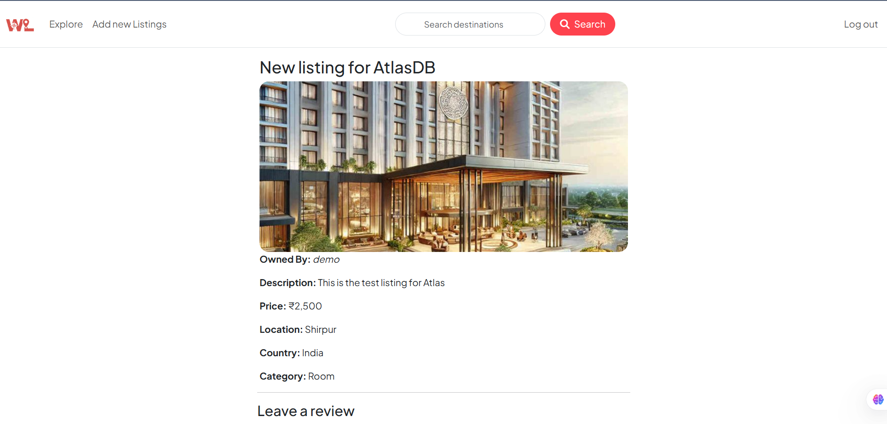
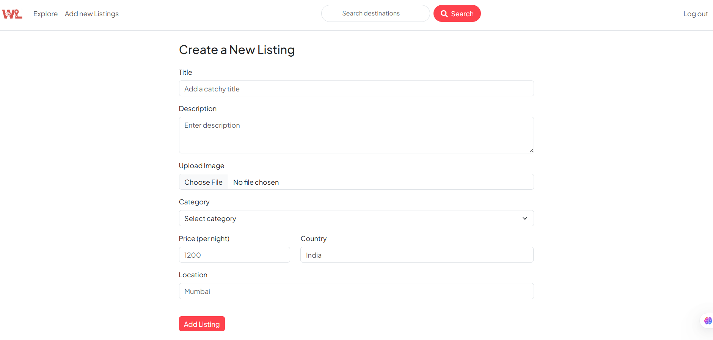
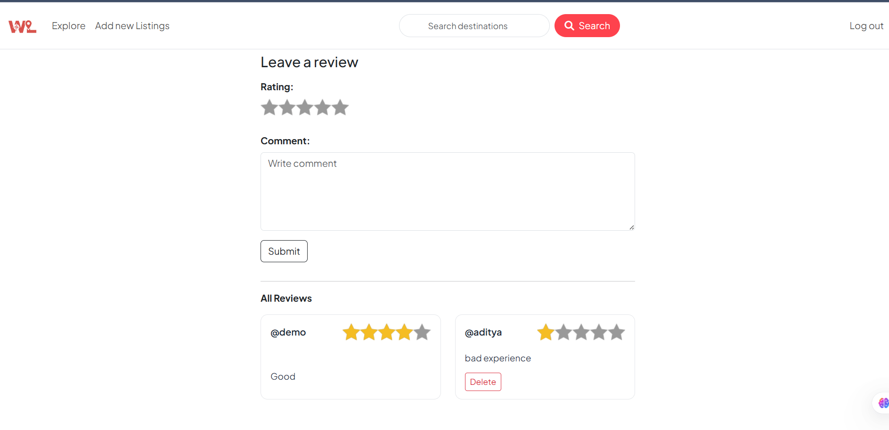
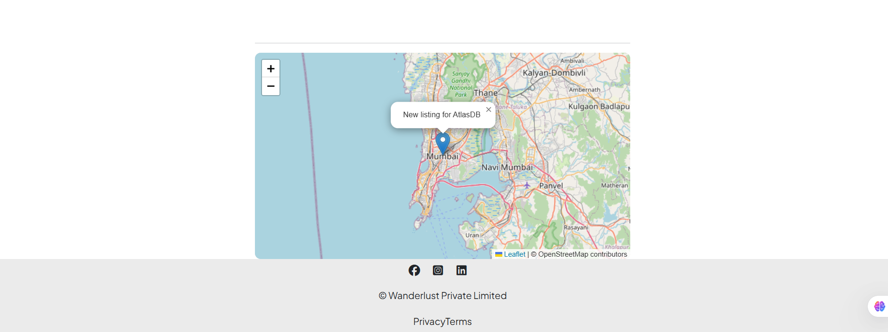
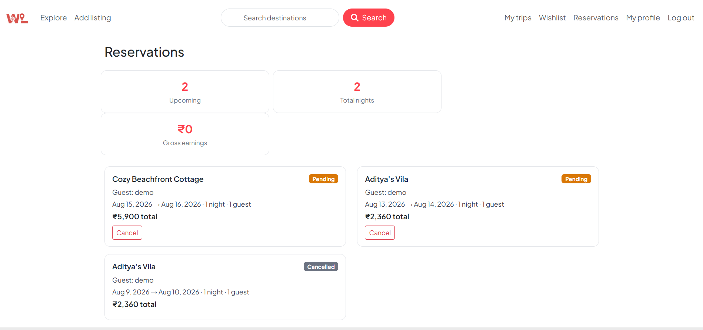
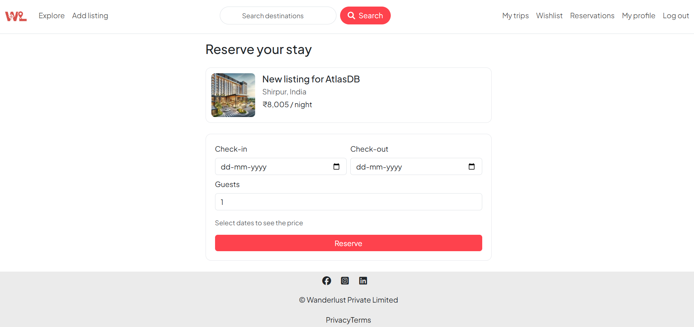
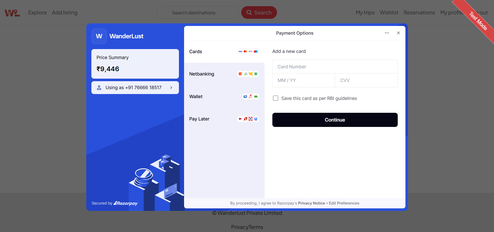
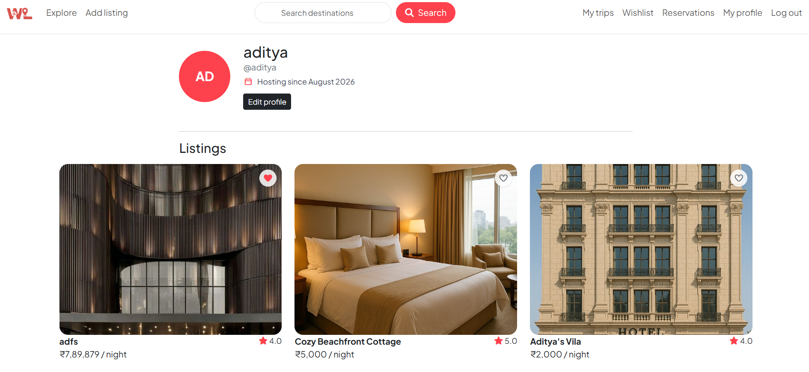

# 🌍 WanderLust

A full-stack property listing web application where users can discover, create, review, and manage travel accommodations. Built with Node.js, Express, MongoDB Atlas, and EJS, with image uploads powered by Cloudinary and secure authentication using Passport.

🔗 **Live Demo:** [https://wanderlust-qckl.onrender.com](https://wanderlust-qckl.onrender.com)

---

## ✨ Features

* 🔐 User authentication & authorization (Passport.js)
* 🔒 Secure password hashing & session management (connect-mongo)
* 🙍 User profiles - avatar (Cloudinary), bio, location, member-since date
* 🏷️ Customer/owner role system with a "Become a host" upgrade flow
* 🏠 Create, edit, delete property listings (CRUD)
* 🖼️ Image uploads with Cloudinary
* 📅 Booking system - overlap-safe date selection, server-computed pricing,
  cancellation rules, host dashboard, and a guest "My Trips" page
* 💳 Real Razorpay payment integration - order creation, HMAC-verified
  confirmation, signed webhook as source of truth, refunds on cancellation
* 🧾 PDF booking receipts
* ❤️ Wishlist (heart toggle) for saving listings
* ⭐ Reviews & ratings, with cached average rating per listing
* 🔍 Search listings by title or country
* 🎛️ Left-hand filter sidebar - category, host, location, price, sorting,
  AJAX filtering, and a mobile drawer
* 🧭 Location geocoding with map coordinates
* ⚙️ RESTful API architecture
* 🧱 Middleware-based validation & protection
* ❗ Centralized error handling

---

## 🛠️ Tech Stack

**Backend**

* Node.js
* Express.js
* MongoDB Atlas
* Mongoose

**Frontend**

* EJS
* Bootstrap 5

**Authentication & Security**

* Passport.js
* express-session
* connect-mongo

**File Storage**

* Cloudinary
* Multer

**Payments & Documents**

* Razorpay
* PDFKit (booking receipts)

**Deployment**

* Render
* Docker

---

## 🚀 Getting Started (Local Setup)

### 1. Clone the repository

```bash
git clone https://github.com/your-username/wanderlust.git
cd wanderlust
```

### 2. Install dependencies

```bash
npm install
```

### 3. Create a `.env` file

See [`.env.example`](.env.example) for the full list of variables. At minimum:

```env
ATLAS_DB_URL=your_mongodb_atlas_url
SESSION_SECRET=your_session_secret
CLOUD_NAME=your_cloud_name
CLOUD_API_KEY=your_cloudinary_key
CLOUD_API_SECRET=your_cloudinary_secret
RAZORPAY_KEY_ID=your_razorpay_key_id
RAZORPAY_KEY_SECRET=your_razorpay_key_secret
RAZORPAY_WEBHOOK_SECRET=your_razorpay_webhook_secret
NODE_ENV=development
```

### 4. Run the application

```bash
nodemon app.js
```

Open your browser at:

```
http://localhost:8080
```

> **Windows shortcut:** double-click [`start.bat`](start.bat) instead of steps
> 2-4 - it installs dependencies if needed, checks for a `.env` file, and
> starts the server.

---

## 🌐 Environment Variables (Production)

These must be configured on your hosting platform (Render):

* `ATLAS_DB_URL`
* `SESSION_SECRET`
* `CLOUD_NAME`
* `CLOUD_API_KEY`
* `CLOUD_API_SECRET`
* `RAZORPAY_KEY_ID`
* `RAZORPAY_KEY_SECRET`
* `RAZORPAY_WEBHOOK_SECRET`
* `NODE_ENV=production`

---

## 💳 Testing Payments (Razorpay Test Mode)

Bookings go through Razorpay before they're confirmed. To test the flow locally:

1. Use your Razorpay **test mode** keys (dashboard → Settings → API Keys) for
   `RAZORPAY_KEY_ID` / `RAZORPAY_KEY_SECRET` in `.env`. Test mode never moves
   real money.
2. For the webhook (`POST /webhooks/razorpay`), Razorpay needs a public URL —
   locally, expose your dev server with a tunnel (e.g. `ngrok http 8080`),
   then in the Razorpay dashboard go to Settings → Webhooks → Add New
   Webhook, point it at `https://<your-tunnel>/webhooks/razorpay`, subscribe
   to `payment.captured` and `payment.failed`, and set a secret. Put that
   secret in `RAZORPAY_WEBHOOK_SECRET`.
3. Book a listing, click **Pay now**, and in the Razorpay checkout modal use
   a test card:
   * Card number: `4111 1111 1111 1111`
   * Expiry: any future date
   * CVV: any 3 digits
   * Name: any
4. A successful payment fires `payment.captured` to the webhook, which flips
   the booking to `confirmed` — check `/trips` a few seconds after paying.
   To test the failure path, use Razorpay's documented test failure card
   instead (see their [test card docs](https://razorpay.com/docs/payments/payments/test-card-upi-details/))
   and confirm the booking's dates are freed up (status `cancelled`) instead
   of confirmed.

---

## 🐳 Running with Docker

The app can run in Docker without a local MongoDB container - it connects
to your existing MongoDB Atlas cluster the same way it does outside Docker,
via `ATLAS_DB_URL` in `.env`.

**Prerequisites:** Docker Desktop running, and a `.env` file in the project
root (see [`.env.example`](.env.example) / the setup steps above).

> **Note on ports:** the app itself always listens on `8080` internally
> (unchanged). Docker maps host port **3000** to that internal `8080`, so
> once running you visit `http://localhost:3000`, not 8080.

### Build the image

```bash
docker build -t wanderlust .
```

### Start with Docker Compose (recommended)

```bash
docker compose up -d
```

Visit `http://localhost:3000`. Compose reads all config from `.env` -
nothing is hardcoded in the image or compose file.

### Stop the container

```bash
docker compose down
```

### Rebuild after changing code or dependencies

```bash
docker compose up -d --build
```

### Troubleshooting

* **Can't connect to MongoDB Atlas from inside the container** - Atlas'
  Network Access list must allow your outbound IP (or `0.0.0.0/0` for
  testing). A container's outbound traffic still looks like it's coming
  from your host machine, but double-check if you're on a restrictive
  network/VPN.
* **`http://localhost:3000` doesn't load** - confirm the container is
  actually running (`docker ps`) and that nothing else on your machine is
  already using port 3000 (`docker compose up` will fail loudly with a port
  conflict if so - change the left-hand side of `3000:8080` in
  `docker-compose.yml` if you need a different host port).
* **Logged in, but the session doesn't stick / login loops** - this
  happens if `NODE_ENV=production` is set in `.env` while you're serving
  plain `http://` (e.g. local testing): `app.js` marks session cookies
  `secure: true` in production, and browsers won't send secure cookies over
  a non-HTTPS connection. Leave `NODE_ENV` unset (or not `production`) for
  local Docker testing, and only set it once you're actually behind HTTPS.
* **Cloudinary/Razorpay requests failing** - verify `CLOUD_NAME` /
  `CLOUD_API_KEY` / `CLOUD_API_SECRET` and `RAZORPAY_KEY_ID` /
  `RAZORPAY_KEY_SECRET` are present and correct in `.env` - the container
  gets no defaults for these.
* **Code changes not showing up** - this setup copies source into the image
  at build time (no volume mount / hot reload), so you need
  `docker compose up -d --build` after edits, not just `docker compose up -d`.
* **`.env` values seem ignored** - `.dockerignore` excludes `.env` from what
  gets *copied into the image* (so secrets never get baked into it), but
  `docker-compose.yml` still reads it from disk via `env_file` at container
  start. Make sure `.env` actually exists in the project root next to
  `docker-compose.yml`.

---

## 📁 Project Structure (Simplified)

```
PROJECT/
│── app.js
│── models/          # listing, user, booking, payment, review
│── routes/
│── controllers/      # listings, users, bookings, payments, reviews
│── views/
│   │── bookings/     # reserve, pay, trips, host dashboard
│   │── users/        # profile, edit profile, become host
│   └── listings/
│── public/
│   │── css/
│   └── js/            # booking, payment, wishlist, filter sidebar
│── scripts/           # one-off data backfill scripts
│── utils/
│── .env (ignored)
│── package.json
│── start.bat          # Windows double-click launcher
```

---

## 🧪 Key Learnings

* Building RESTful APIs with Express
* Session persistence using MongoDB
* Secure authentication & authorization
* Cloud image storage integration
* Production deployment & environment configuration
* Debugging real-world backend issues

---

## 📸 Screenshots

### Home Page


### Filters


### Listing Details


### Create Listing


### Reviews


### Map 


### Reservation


### Booking


### Razorpay Payment


### Trip History


### User Profile



---

## 📜 License

This project is for educational and portfolio purposes.

---

## 🙌 Acknowledgements

Inspired by modern accommodation platforms and built as a full-stack learning project.

---

If you like this project, feel free to ⭐ the repository!
